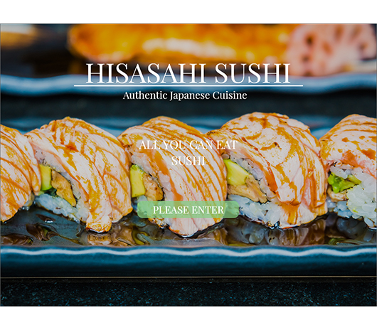
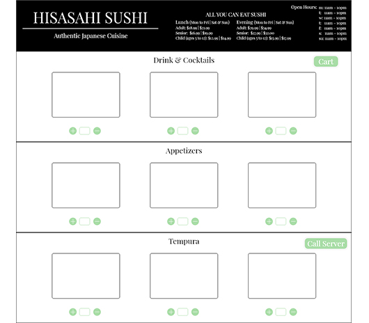
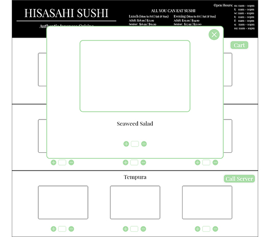
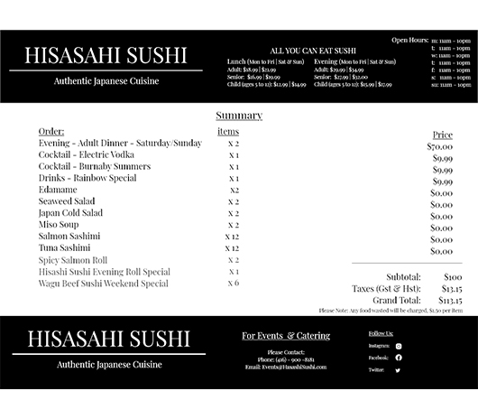

# tabletMenuApp
tabletMenuApp

This will be the repository for the DESIGN frontend portion of tablet application. The design is based on a Japanese Sushi restuarant. It will be separated into three portions the front page, the menu items, and lastly the cart. 

1) Front page will be a three page auto slider, have one button to enter the into the menu page.

2) Menu item consist of summary button 'cart', call button 'call server', and + - sign for adding items. 

3) It will also have a pop-up window to showcase a closer view of the selected item if user double-clicks on the item.

4) Summary page will display the total amount of items selects, the calculated cost.

Note: Use the layout folder for full sized images for reference.
